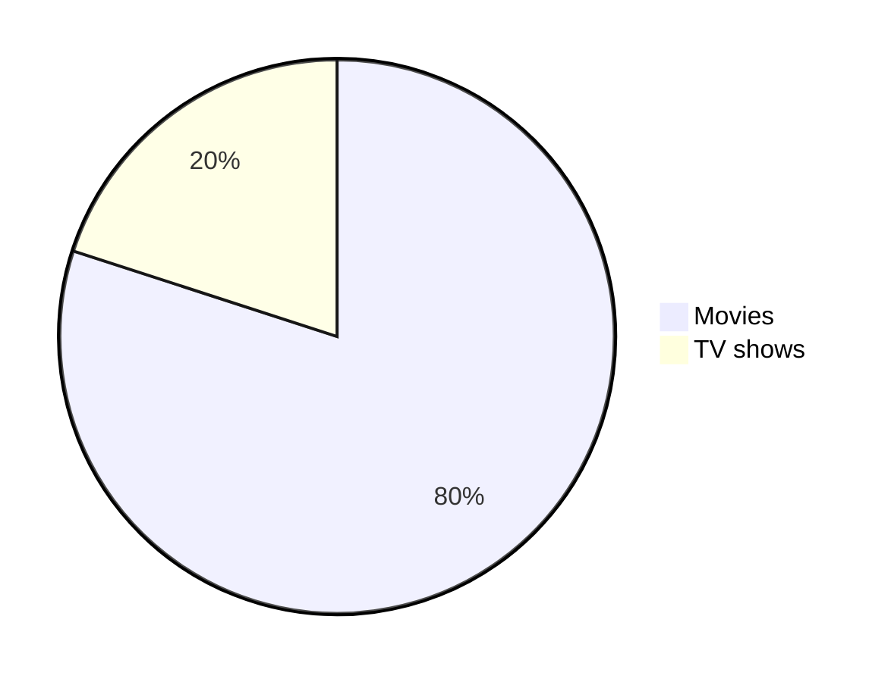

# MD Cheatsheet
These are summaries I come accross from cheatsheets, which I have reference.

## Heading

```md
# Heading 1 
## Heading 2
### Heading 3 ...
```

## Text Style

```md
**bold**
*italic*
<ins>underline</ins>
> quote block
~~Strick through~~
<samp>monospace</samp>

Multiline\
line2\
line3

<br> for when '\' doesn't wor

Different Quote Style
> [!IMPORTANT]
> [!TIP]
> [!NOTE]
> [!WARNING]
> [!CAUTION]

```diff
- Text in Red
+ Text in Green
! Text in Orange
# Text in Gray
@@ Text in Purple and bold @@```
```

> [!IMPORTANT]

> [!TIP]

> [!NOTE]

> [!WARNING]

> [!CAUTION]

```diff
- Text in Red
+ Text in Green
! Text in Orange
# Text in Gray
@@ Text in Purple and bold @@
```

## Alignment

```md
Only with HTML

<div align="left">  </div>
<div align="center">  </div>
<div align="right">  </div>
```
<div align="left">  </div>
<div align="center">  </div>
<div align="right">  </div>
<h3 align="center"> center align heading with HTML</h3>

## Table

```md
| Default | Left align | Center align | Right align|
| - | :- | :-: | -: |
| 9999999999 | 9999999999 | 9999999999 | 9999999999 |
| 999999999 | 999999999 | 999999999 | 999999999 |
| 99999999 | 99999999 | 99999999 | 99999999 <br/> line2 <br/> line3|
| 9999999 | 9999999 | 9999999 | 9999999 |
```
| Default | Left align | Center align | Right align|
| - | :- | :-: | -: |
| 9999999999 | 9999999999 | 9999999999 | 9999999999 |
| 999999999 | 999999999 | 999999999 | 999999999 |
| 99999999 | 99999999 | 99999999 | 99999999 <br/> line2 <br/> line3|
| 9999999 | 9999999 | 9999999 | 9999999 |

```md
<table>
<tr>
<th>Heading 1</th>
<th>Heading 2</th>
</tr>
<tr>

<td>

| A | B | C |
|--|--|--|
| 1 | 2 | 3 |

</td><td>

| A | B | C |
|--|--|--|
| 1 | 2 | 3 |

</td></tr> </table>
```

<table>
<tr>
<th>Heading 1</th>
<th>Heading 2</th>
<th>Heading 3</th>
</tr>
<tr>

<td>

| A | B | C |
|--|--|--|
| 1 | 2 | 3 |

</td><td>

| A | B | C |
|--|--|--|
| 1 | 2 | 3 |

</td><td>
And so on...</td></tr> </table>

## Links and Images


```md
Inline link
[Name](url or file-path)

Reference
[Name][reference text]
[name][1]

Images
 //embed file

[reference-link]

[reference text]: url
[1]: url or file-path
[reference-link]: url
```

## Footnotes

```md
Footnote.[^1]

Some other important footnote.[^2]

[^1] : Footnotes
[^2] : Footnotes
```

## Numbered List

```md
1. One
2. Two
3. Three
- Thing 1
- Thing 2
- Thing 3
- [ ] Todo 1
- [ ] Todo 1
- [x] Todo 1
```

## Button
```md
<kbd>cmd + shift + p</kbd>
<details>
  <summary>Title</summary>
- Bullet need break line <br>
- Another thing <br>
Another line
</details>
```
<kbd>cmd + shift + p</kbd>

<details>
  <summary>Title</summary>
- Hello <br>
- Another thing <br>
Another line
</details>

## Diagram


## Misc
```
Horizontal Rule
---
```

## Reference

[Cheatsheet](https://github.com/lifeparticle/Markdown-Cheatsheet/blob/main/README.md#images)