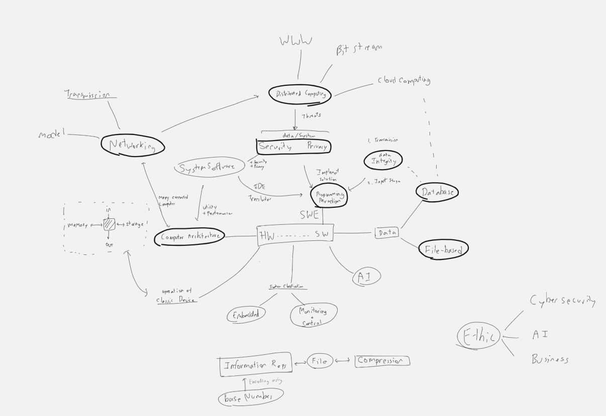

# Naldo's AS-A2 CS Wiki

This Wiki contain information revelant to pass AS-A2 CS.
Take a look at [Math-wiki](../math/math.ipynb) and [Physic-wiki](../physic/physic.ipynb)

Take a look at [CS](../cs/cs.ipynb)

## Main Relationship between 

## [Software Engineering](software-engineering.ipynb)

- **Software Development Life Cycle (SDLC)**
- **Software Development Methodologies**
- **Design Patterns**
- **Version Control Systems**

## [Algorithms and Data Structures](algorithms-and-data-structures.ipynb)

- **Basic Data Structures**
- **Trees and Graphs**
- **Algorithms**

## [Programming Paradigm](programming-paradigm.ipynb)

- **Procedural Programming**
- **Object-Oriented Programming**
- **Functional Programming**
- **Scripting Languages**
- **Declarative Programming**

## [Computer Architecture](computer-architecture.ipynb)

- **Basic Architecture**
- **Advanced Architecture**
- **Memory Hierarchy**
- **Assembly Language**

## [OS and System Software](os-system-software.ipynb)

- **Basic Concepts**
- **Advanced Topics**
- **Popular Operating Systems**

## [Computer Networks](computer-networks.ipynb)

- **Networking Basics**
- **Networking Protocols**
- **Wireless Networks**
- **Network Security**

## [Distributed System](distributed-system.ipynb)

- **Distributed Computing Models**
- **Cloud Computing**
- **Peer-to-Peer Networks**
- **Distributed Databases**

## [Cybersecurity](cybersecurity.ipynb)

- **Basic Concepts**
- **Cryptography**
- **Network Security**
- **Application Security**

## [Databases](databases.ipynb)

- **Database Models**
- **SQL (Structured Query Language)**
- **Database Design**

## [Artificial Intelligence](artificial-intelligence.ipynb)

- **Machine Learning**
- **Deep Learning**
- **Natural Language Processing (NLP)**
- **Robotics**

## [Ethics](ethics.ipynb)

- **Basic Concept**
- **Licensing**
- **Copyright**