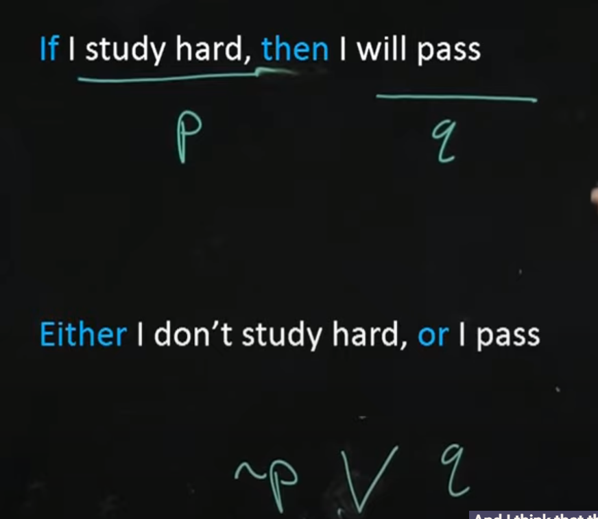

# Discrete Mathematic

## Foundations
### 1. Set Theory
:::{admonition} Definition
:class: dropdown, note

Set
: A collection of distinct objects, considered as an object in its own right.

Tuple ($a_1, a_2,\ldots,a_n$)
: An ordered list of elements. $n$-tuple has $n$ elemnets. 

Bag/Multiset [^bag]
: A collection of elements where each element can appear more than once. The multiplicity of an element is the number of times it appears in the bag.

Element
: An object that belongs to a set.

Subset
: $A \subseteq B$ if ever element of $A$ is also an element of $B$.

Proper Subset
: ALl the subset not including it self. As seen in the "less than" only sign $\subset$.

Null Set $\phi$
: An empty set denoted $\phi = \{\}$.

Universal set $\mathcal{U}$
: The set that contains all the objects under consideration.

Cardinality
: The number of elements in the set.

Power set
: The set of all subsets of a set $A$, denoted by $\mathcal{P}(A)$.

**Operation**

$A\cup B,\hspace{2ex} A+B$, Union
: $\{x| x\in A \lor x\in B\}$

$A\cap B,\hspace{2ex} AB$, Intersection
: $\{x| x\in A \land x\in B\}$

$A-B$, Difference
: $\{x| x \in A \land x \notin B\}$

$\bar A, \hspace{2ex} \mathcal{U}-A$, Complement
: $\{x| x\notin A\}$ \
$\{x| x \in \mathcal{U} \land x \notin A\}$

$A\times B$, Cartesian Product
: $\{(a,b)| a\in A \land b\in B\}$
:::

:::{admonition} Axiom
:class: dropdown, note

**ZF Set theory**

Extensionality
: Two sets are equal iff they have same element.
: $\forall A\forall B (\forall x (x\in A \iff x \in B)\implies A=B)$
: The converse, $\forall A \forall B (A=B \implies \forall x (x\in A \iff x \in B))$

Regularity
: Every non-null set $A$ contains an element $B$ such that $A \land B$ are disjoint.

Pairing
: For any sets $A$ and $B$, there is a set $\{A,B\}$ that contains exctly $A$ and $B$.

Union
: For any set $A$, there is a set $\bigcup A$ that that contains all elements of the elements of $A$.

Power Set
: For any set $A$, there is a set $\mathcal{P}(A)$ that contains all the subsets of $A$.

Infinity
: There exists a set $\mathbb{N}$ that contains the $\phi$ and is closed under the successor function.

Replacement
: The image($R_f$) of a set under any definable function is also a set.

Choice
: For any set of non-null sets, there exists a choice function that selects an element from each set.
: *This implies the [Well-Ordering Principle][WoP]*
:::

:::{admonition} Lemma
:class: dropdown, notev

**Laws in both set and logic**

Double Negation, I
: $\overline{\overline{A}} \equiv A$

Identity, II
: $A+\phi\equiv A$
: $A\mathcal{U} \equiv A$

Idempotent, III
: $A+A \equiv A$
: $AA \equiv A$

Inverse, IV
: $A+\bar{A}\equiv\mathcal{U}$
: $A\bar{A}\equiv\phi$

Domination, V
: $A+\mathcal{U}\equiv\mathcal{U}$
: $A\phi\equiv\phi$

De Morgan's, VI <- I
: $\overline{A+B}\equiv\bar{A}\bar{B}$
: $\overline{AB}\equiv\bar{A}+\bar{B}$

Absorbtion, VII
: $A+(AB)\equiv A$
: $A(A+B)\equiv A$

**Like Algebra**

Double Negation, I
: Even number of negation is equivalent to having no negation.

Property of zero
: II Identity property of Addition, first one, 1 + 0 = 1
: V Multiplicative, second one, 1*0 = 0
: 4 Identity property of Substraction, second one, A-0 = A

Commutative, 1
: $A+B\equiv B+A$ 
: $AB\equiv BA$

Associative, 2
: $A+(B+C)\equiv (A+B)+C$
: $A(BC)\equiv (AB)C$

Distributive, 3
: $A+(BC)\equiv (A+B)(A+C)$
: $A(B+C)\equiv (AB)+(AC)$

Cancellation, 4
: $A-A\equiv\phi$
: $A-\phi\equiv A$

**Difference Rule**

Involution[^involution], 5
: $A-(A-B)\equiv AB$

De Morgan's, 6
: $A-(B+C)\equiv (A-B)(A-C)$
: $A-(BC)\equiv (A-B)+(A-C)$

Right-Distributive, 7
: $(A+B)-C\equiv (A-C)+(B-C)$
: $(AC)-C\equiv (A-C)(B-C)$
:::

:::{admonition} Additional Lemmas
:class: dropdown

Transitive Closure Lemma
: If \( R \) is a transitive relation, then its transitive closure \( R^+ \) is also transitive.

Schröder-Bernstein Lemma
: If there are injections from set \( A \) to set \( B \) and from set \( B \) to set \( A \), then there is a bijection between \( A \) and \( B \).

Cantor's Diagonal Lemma
: There is no surjection from a set \( A \) to its power set \( \mathcal{P}(A) \).

Zorn's Lemma
: If every chain (totally ordered subset) in a partially ordered set \( P \) has an upper bound in \( P \), then \( P \) contains at least one maximal element.
:::
#### Well-Ordering Principle
::::{admonition} Theorem 1.1 - Well-Ordering Principle[^wop]
:class: tip, dropdown

:::{admonition} Proof
:class: toggle

To be continue...
:::

---

**Importance**

Induction Principle
: Foundation for mathematical induction over natural number.

Set Theory
: foundational results about sets and their properties, especially those related to ordering and minimal elements.
::::

### Logic

:::{admonition} Definition
:class: dropdown, note

Proposition
: A declarative statement that hold one truth value (True or False)

Contingency
: A proposition that is neither a tautology
nor a contradiction.

Predicate
: Relation involving variables that become propositions when the variables are given specific values or there exist a quantifier on the variable.

Vacuous Truth/ Vacuously True
: True in an empty sort of ways. There is no statement that proof it to be false otherwise.
: The conditional statement P -> Q for all $\bar p$ then it will always be true, because there is no reason for them to be false.

Logical Equivalence $\equiv, \Leftrightarrow$
: two logical expression is the same if their truth table are the same. 

Tautology $T$
: Proposition that is always TRUE

Contradiction $F$
: Proposition that is always FALSE

Antecendent
Consequent

**Conditional**

Implication in semantics
:  Choose whether you believe these two sentences mean the same thing or not.

R -> S is a Tautology then we write R => S
: $[(R\to s)\to T] \to R\Rightarrow s $

R <-> S is a tautology then we write R <=> S
: $[(R\leftrightarrow S)\to T] \to R\Leftrightarrow S$ [^LE]
: $[(R\leftrightarrow S)\to T] \to R\equiv S$ [^Identical]

Converse of P -> Q
Inverse of P -> Q
Contrapositive of P -> Q

Sufficient
: $A\Rightarrow B$,
: A is sufficient for B because we know A leads to B and we did not know if without A, can there be B.

Necessary
: $\bar A\Rightarrow \bar B$
: For a conditional, A => B, B is necessary for A. Consider the contrapositive, NOT B => NOT A.

**Argument**

Valid argument and inference rule

Premise
: Initial information that we know/assume to be true

Modus Ponen
Modus Tollen
Generalisation
Specialisation
Contradiction

**Quantifier**

Compound Quantifier
: This only happen when another quantifier is a part of the predicate of the first quantifier.

Negating Quantifier
: 

**Booolean Algebra** 

Normal Form
Conical Form
Conjunctive Normal Form
Disjunctive Normal Form

:::

:::{admonition} Axiom
:class: dropdown, note

:::

:::{admonition} Lemma
:class: dropdown, note

**Set Law's Analouge for Logic**

Identity, II
: $P+F \equiv P$
: $PT \equiv P$

Domination, V
: $P+T \equiv T$ (for OR, if one is true, then other will be true)
: $PF\equiv F$ (for AND, if one is false, then there is no true)
:::

- Propositional Logic (Statements, Connectives, Truth Tables)
- Predicate Logic (Quantifiers, Predicates)
- Logical Equivalences
- Inference Rules and Proofs

## 2. Relations and Functions

:::{admonition} Definition
:class: dropdown, note

Relation
: A relation between two set $A, B$ or $Domain, Range$ is a subset of $A\times B$.
: It is an ordered pair (a,b) where $(a,b) \in A\times B$
: We can write a relation e.g. (a,b) means a _own_ b, a > b or any other meaning.

Relation on $A$ / Directed Graph  
: Relation of A on itself.
: relate element in a domain with codomain = the domain.

Inverse Relation of AxB
: Inverse of the relation which is a subset of $A\times B$ is a subset of $B\times A$

Equivalence Relation on $A$
: Relation that is all reflexive, symmetric, and transitive.
: Definition of equality. It is the equality of modular arithmetic.

Property of a Relation on $A$ ($x,y \in A$)

Reflexive
: Relation that relate to itself, $\forall x, f(x) = x$

Symmetric
: Bidirectional direction, $\forall x,y, f(x)=y \to f(y)=x$

Transitive
: x -> y and y -> z THEN x -> z

**Function**

Function
: Function 1. does something to every input $\in D$ 2. output only one thing $\in R$.
: Formal: A function, f, between D and R is a **relation** such that $(d,r) \in f$ or $f(d) = r$, and $(d,r) \in f \land (d', r) \in f$ then $d=d'$ 

:::

### Relations
- Properties of Relations (Reflexive, Symmetric, Transitive)
- Equivalence Relations and Partitions
- Partial Orders

### Functions
- Definition and Types (Injective, Surjective, Bijective)
- Composition and Inverse Functions
- Graph of a Function

## 3. Counting and Combinatorics
### Basic Counting Principles
- Permutations and Combinations
- Pigeonhole Principle

### Advanced Counting Techniques
- Inclusion-Exclusion Principle
- Recurrence Relations
- Generating Functions

## 4. Number Theory
### Divisibility and Prime Numbers
- Greatest Common Divisor (GCD)
- Euclidean Algorithm

### Modular Arithmetic
- Congruences
- Chinese Remainder Theorem

### Cryptography Basics
- RSA Algorithm
- Public Key Cryptography

## 5. Graph Theory
### Basics of Graphs
- Types of Graphs (Undirected, Directed, Weighted)
- Graph Terminology (Vertices, Edges, Degree)

### Graph Algorithms
- Paths and Circuits
- Eulerian and Hamiltonian Paths
- Shortest Path Algorithms (Dijkstra’s, Bellman-Ford)
- Minimum Spanning Tree (Kruskal’s, Prim’s)

## 6. Trees
### Properties of Trees
- Definition and Terminology (Root, Leaf, Height)
- Binary Trees, Binary Search Trees

### Tree Traversals
- Preorder, Inorder, Postorder

### Applications of Trees
- Expression Trees
- Huffman Coding

## 7. Algebraic Structures
### Groups, Rings, and Fields
- Definitions and Examples
- Group Homomorphisms

### Boolean Algebra
- Boolean Functions
- Simplification of Boolean Expressions
- Applications in Digital Logic

## 8. Automata Theory and Formal Languages
### Finite Automata
- Deterministic Finite Automata (DFA)
- Non-Deterministic Finite Automata (NFA)

### Regular Expressions

### Context-Free Grammars

### Turing Machines

## Recommended Learning Path
1. Foundations (Set Theory, Logic, Relation and Function)
2. Counting and Combinatorics
3. Number Theory
4. Graph Theory
5. Trees
6. Algebraic Structures
7. Automata Theory and Formal Languages
8. Type Theory
ormal Language

[^involution]: a function, transformation, or operator that is equal to its inverse, i.e. which gives the identity when applied to itself.
[^bag]: Not as important as other data strucutre for now.
[^wop]: Every non-empty set of positive integers (or more generally, every non-empty subset of a well-ordered set) has a least element. In simpler terms, it states that any subset of integers or set with a defined ordering will have a smallest element.
[^LE]: Prefer to use this for writing proof of logical equivalence in a logical line by line writing. {we can addd the left and right arrow to every equal at the end of the proof}
[^Identical]: Prefer to use this for the end to conclude that first statement is indentical to the last statement.

[WoP]: #well-ordering-principle
