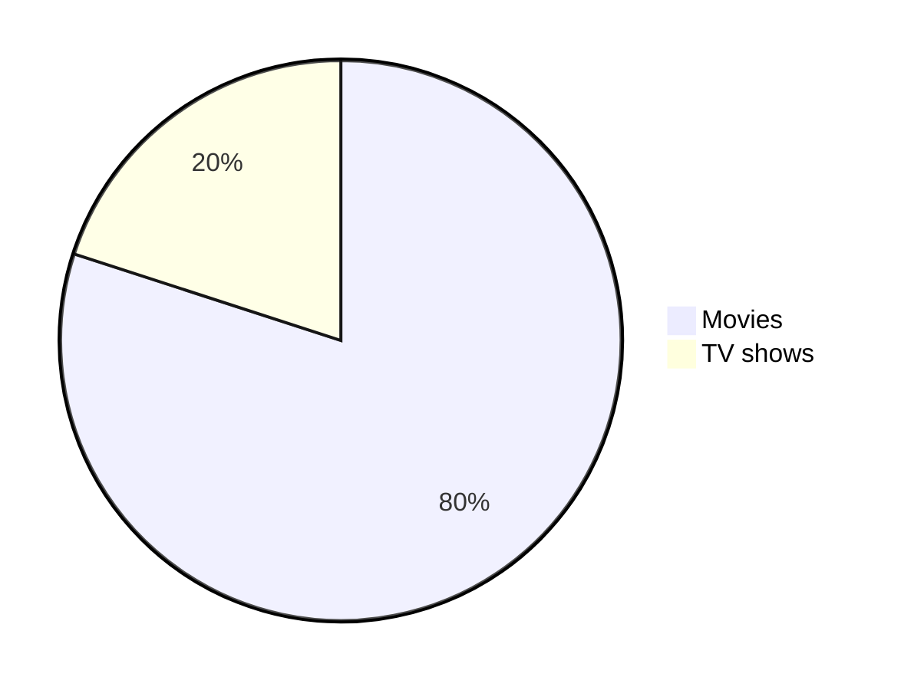

# MD Cheatsheet
These are summaries I come accross from cheatsheets, which I have reference. MyST is also included

## Heading

```md
# Heading 1 
## Heading 2
### Heading 3 ...
```

## Text Style

```md
**bold**
*italic*
<ins>underline</ins>
> quote block
~~Strick through~~
<samp>monospace</samp>

Multiline\
line2\
line3

<br> for when '\' doesn't wor

Different Quote Style
> [!IMPORTANT]
> [!TIP]
> [!NOTE]
> [!WARNING]
> [!CAUTION]

```diff
- Text in Red
+ Text in Green
! Text in Orange
# Text in Gray
@@ Text in Purple and bold @@```
```

> [!IMPORTANT]

> [!TIP]

> [!NOTE]

> [!WARNING]

> [!CAUTION]

```diff
- Text in Red
+ Text in Green
! Text in Orange
# Text in Gray
@@ Text in Purple and bold @@
```

## Alignment

```md
Only with HTML

<div align="left">  </div>
<div align="center">  </div>
<div align="right">  </div>
```
<div align="left">  </div>
<div align="center">  </div>
<div align="right">  </div>
<h3 align="center"> center align heading with HTML</h3>

## Table

```md
| Default | Left align | Center align | Right align|
| - | :- | :-: | -: |
| 9999999999 | 9999999999 | 9999999999 | 9999999999 |
| 999999999 | 999999999 | 999999999 | 999999999 |
| 99999999 | 99999999 | 99999999 | 99999999 <br/> line2 <br/> line3|
| 9999999 | 9999999 | 9999999 | 9999999 |
```
| Default | Left align | Center align | Right align|
| - | :- | :-: | -: |
| 9999999999 | 9999999999 | 9999999999 | 9999999999 |
| 999999999 | 999999999 | 999999999 | 999999999 |
| 99999999 | 99999999 | 99999999 | 99999999 <br/> line2 <br/> line3|
| 9999999 | 9999999 | 9999999 | 9999999 |

```md
<table>
<tr>
<th>Heading 1</th>
<th>Heading 2</th>
</tr>
<tr>

<td>

| A | B | C |
|--|--|--|
| 1 | 2 | 3 |

</td><td>

| A | B | C |
|--|--|--|
| 1 | 2 | 3 |

</td></tr> </table>
```

<table>
<tr>
<th>Heading 1</th>
<th>Heading 2</th>
<th>Heading 3</th>
</tr>
<tr>

<td>

| A | B | C |
|--|--|--|
| 1 | 2 | 3 |

</td><td>

| A | B | C |
|--|--|--|
| 1 | 2 | 3 |

</td><td>
And so on...</td></tr> </table> 

```{list-table}
:header-rows: 1

* - Col1
  - Col2
* - Row2 under Col1
  - Row2 under Col2
* - Row3 under Col1
  - Row3 under Col2
```

## Math
````
Inline $ <equation> $
block
$$
$$ (mylabel)

same as 

``` {math}
:label: eqlabel
<equation>
```

since I include amsmath, we can use
\begin{equation}
\end{equation}
...as well

````
Inline $x^2 + x =4$
block
$$
x^2 + x =4

$$ (mylabel)

``` {math}
:label: eqlabel
x^2 + x =4

```

since I include amsmath, we can use
\begin{equation}
x^2 + x =4
\end{equation}
...as well

I can reference {eq}`mylabel` and {eq}`eqlabel`

## Links and Images


```md
Inline link
[Name](url or file-path)

Reference
[Name][reference text]
[name][1]

Images
 //embed file

[reference-link]

[reference text]: url
[1]: url or file-path
[reference-link]: url
```
  
````
```{figure} ./path/to/figure.jpg
:name: image-1 
:height: 120px

caption
```

```{image} ./path/to/image.jpg
:height: 150px
:name: figure-example

Here is my figure caption!
```
````
## Footnotes

```md
Footnote.[^1]

Some other important footnote.[^2]

[^1] : Footnotes
[^2] : Footnotes
```

## Numbered List

```md
1. One
2. Two
3. Three
- Thing 1
- Thing 2
- Thing 3
- [ ] Todo 1
- [ ] Todo 1
- [x] Todo 1
```

## Button
```md
<kbd>cmd + shift + p</kbd>
<details>
  <summary>Title</summary>
- Bullet need break line <br>
- Another thing <br>
Another line
</details>
```
<kbd>cmd + shift + p</kbd>

<details>
  <summary>Title</summary>
- Hello <br>
- Another thing <br>
Another line
</details>

## Diagram


## Misc
```
Horizontal Rule
---
```

## MyST Syntax

````

```{admonition} Title
:class: <name> (may or may not be use)

Text

```
````

Admonition type:

- tip
- note
- warning
- caution 
- attention
- danger
- error
- hint
- important

code cell tag
````
```{code-cell} ipython3
:tags: ["following tag name"]

note = "Python syntax highlighting"
print(note)
```
````
- "full-width"
- "scroll-output"
- "margin"
- "hide-input"
- "hide-output"
- "hide-cell"
- "remove-input"
- "remove-output"
- "remove-cell"
- "raises-exception"  

```{toggle}
This is a toggle
```

```{admonition} Click the button to reveal!
:class: dropdown
Some hidden toggle content!
```

```{dropdown}
This is a drop down
```

````{grid}
:gutter: 2

```{grid-item}
:outline:
A
```
```{grid-item}
:outline:
B
```
```{grid-item}
:outline:
C
```
```{grid-item}
:outline:
D
```

````

````{grid}
:gutter: 3

```{grid-item-card} One!
Here's the first card.
```

```{grid-item-card} Two!
Here's the second card.
```

```{grid-item-card} Three!
Here's the third card.
```
````

```
A card title: The argument given to the directive.

A card header: Any content that precedes a line with ^^^.

A card footer: Any content that comes after a line with +++.

A card body: Any content that comes in between ^^^ and +++.
```

````{card}
Content of the top card.

{bdg-primary}`example-badge`

````

````{card}

```{button-ref} content/cards
:class: stretched-link

Clickable bottom card
```

````

```{admonition} Click here!
:class: tip, dropdown
Here's what's inside!
```

```{note}
:class: dropdown
The note body will be hidden!
```

Myst tab with normal sphinx design

````{tab-set}
```{tab-item} Tab 1 title
My first tab
```

```{tab-item} Tab 2 title
My second tab with `some code`!
```
````

sphinx inline tab extension:  

````{tab} Python
```python
def main():
    return
```
````

````{tab} C++
```c++
int main(const int argc, const char **argv) {
  return 0;
}
```
````

Isn't it cool

## Reference

[Cheatsheet](https://github.com/lifeparticle/Markdown-Cheatsheet/blob/main/README.md#images)