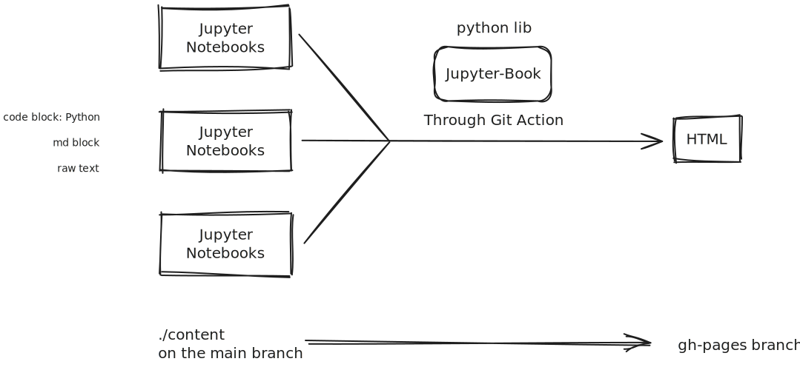

# Getting Started

## The project

This project was started due to a small intrinsic motivation to create complete and high-integrity information within subjects as simply as possible, and focus only on the main important ideas. These documents will be useful for learning and revision resources for anyone. By using ipynb, we can use md, and python allowing us to flexibly visualise data, and can be view on web as html or jupyter notebook.

# How it works, convention and collaborating

## The tools



::::{admonition} Markdown Style
:class: Note

There are two types of markdown to be concern
1. CommonMark
2. MyST

In our wiki, since we are using jupyter book, make sure to learn some of the MyST which will make our page looks cleaner.

:::{warning}
MyST are not suppose to be render properly in GitHub, and vscode. Install the [extension](https://marketplace.visualstudio.com/items?itemName=ExecutableBookProject.myst-highlight).
:::
::::

## The directory, branch and files

### What is ./content

There are two branches: main and gh-pages. Any commit-push will run a github action (a virtual linux system that run bash commands), which is setup to build html structure from the ```./content``` and output on gh-pages used for hosting the wiki.

### Folder and file structure

In the `./content`, you can see folder with [a number](folder-number.md), These numbers represent the owner of the resource. Inside the folder, there are specific folder subject and inside has the main file, `subject-name.md`. This file outline all the topic and link to file within the same folder. Inside the number folder is `data` which stores all of the extra file we will use in our ipynb. We can `hold shift` and drag the files into the ipynb/md to get the format of embedding files if we don't want to type.

> **Tips**  
> In any .md files, `ctrl + shift + p` and search for "markdown preview" for live preview. `Hold Ctrl + click` on links to use the links on md without preview mode.

The file `_toc.yml` is table of content of the html page, it is the list of page on the left of the page. See [Jupyter Book](https://jupyterbook.org/en/stable/intro.html) for more information.

### Convention

- We use kebab case `like-this.ipynb` for file and directory names.   
- data folder is use to stores extra files like images.
- Learn markdown, have a look at the [cheatsheet](#cheatsheet-docs). 
- All document must have a md block at the top containing bank link. Have a look in Naldo's Wiki as example.

## Referencing sources

Any edit to the wiki or idividual topic must have references at the end of that page, so anyone can find where the information is from and check for correctness. It might be good to do formal Havard APA MLA referencing, but we want to keep it simple for any person to be able to use it.
For now the convention will be 

- `Topic1: [Links Name](url)`
- `Topic2: Book Name (page number)`
- `Topic3: {link, link, book (), link}`
- Additionaly, footnotes may be use to reduce redundancy!

Links can be anything:

- YouTube
- Medium
- PDF
- AI Respond (make sure to share entire chat, or share all relevant chats)

If there are more than one sources use for a topic make sure to use {link, link, book} like using a set notation.

## How to collaborate

Contact me in any messenger app and answer the following question.
What topic/subject do you want to edit/make? (you can make new wiki)

### How to make edit

There are several to edit ipynb files.

- On this Github repo, click `.` or change the `.com` to `.dev` which open an online vs code. After making change we will commit the files by using `Ctrl+Shift+G` and write the message of what we did, then push. Here is the convention:
  - Update file.their extension -> if file is modify
  - update Topic -> if many files relating to the topic is modify
  - Add file.extension -> if new files added
  - Delete file.extension -> if the commit is only to delete file 

For people who prefer local VSCode, use `git clone <link of repo>` and any changes on that folder can be done in the same way as github's VSCode. Look above.

Any recommendation with the documentation is appreciated.

# Current struggle

This is a wish list and a list of problems I encounter in hope that I will see and remember and somehow find solution.

- Learning all sphinx, myst and jupyter notebook usage.
- Creating diagram through excalidraw: I am thinking of creating a python library that can create excalidraw diagram through function. The current solution to use excalidraw extension on VS Code or the website to create diagram.
- Sphinx Advanced Customisation is needed to do the above
  - Theming the Jupyter Book website with css. [Target  Colorscheme](https://rosepinetheme.com/palette/) [Target Font](https://www.jetbrains.com/lp/mono/) (considering it needs to have math symbols and font ligature)
  - Implement a way for people to change the fonts.

## LaTeX

- \underbar can't be use, use \underline instead.


# Collaborator, Maintainer and Creator

- Creator: solipsse
- $\vdots$

# Cheatsheet Docs

[jupyter-book](https://jupyterbook.org/en/stable/file-types/index.html) for advance use. There are many useful code here than others.

## markdown, md

  - [naldo's](./1/misc/markdown.md)
  - [table generator](https://www.tablesgenerator.com/markdown_tables)
  - [excel to md](https://tableconvert.com/)

## LaTex
- https://tilburgsciencehub.com/topics/research-skills/templates-dynamic-content/templates/amsmath-latex-cheatsheet/
- https://tug.ctan.org/info/latex-refsheet/LaTeX_RefSheet.pdf
- https://pages.uoregon.edu/torrence/391/labs/LaTeX-cheat-sheet.pdf
- https://quickref.me/latex.html

## Visualisation Tools
- https://graphviz.org/
- https://docs.manim.community/en/stable/tutorials/quickstart.html
- https://www.geeksforgeeks.org/data-visualization-with-python/
- Geogebra in md documentation example https://jhconning.github.io/Trade340/notebooks/embed_geogebra.html
- something about Desmos implementation into notebook https://stackoverflow.com/questions/33860207/ipython-jupyter-notebook-how-to-embed-interactive-graph-using-desmos-api 
- $\vdots$
