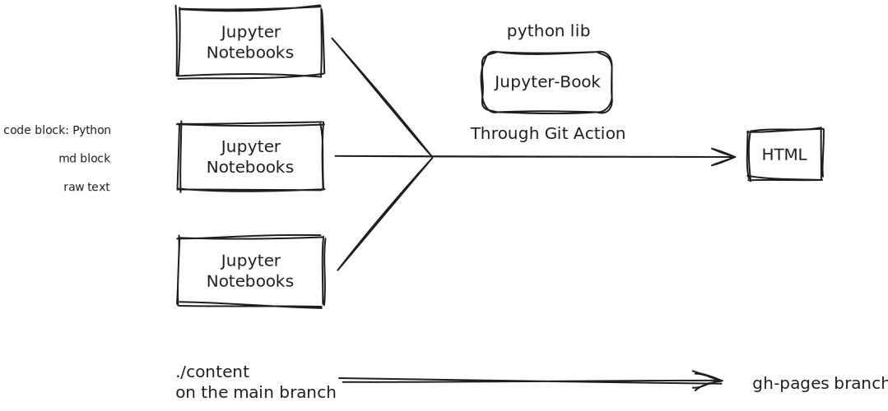

# The project
This project was started due to a small intrinsic motivation to create complete and high-integrity information within subjects as simply as possible, and focus only on the main important ideas. Making documentation like this allows anyone to view it and is highly flexible with the content we want to put in.
# How it works, convention and collaborating
## The tools

## The directory, branch and files
There are two branches: main and gh-pages. Any commit-push will run a github action (a virtual linux system that run bash commands), which is setup to build html structure from the ```./content``` and output on gh-pages used for hosting the wiki.

In the ```./content```, we have different folder for the wikis and the main wikis will be name ```name-wiki.ipynb``` (notice the Kebab Case naming convention). Some old wiki will all be using combination of pascal and kebab case which we hope to change all of them. This main wiki will be use to organise and link to all the other wikis on the same directory.

We are using ipynb, so be creative with the way you want to represent information.
Here is a list of what we could use.

Markdown:
- Table
- Code Block. we will use this for showing file name and directory relative to that folder.
- Headings. We use this to organise the content list.
- Bullet and Number list
- image
- link. redirect to relevant, a must see.
- Horizontal line separator
Code:
- Any python library for data visualisation
- Python code to show ideas
These all mostly the stuff that we will be using.

## Referencing
Any edit to the wiki or idividual topic must have references at the end of that page, so anyone can find where the information is from and check for correctness. It might be good to do formal Havard APA MLA referencing, but we want to keep it simple for any person to be able to use it.
For now the convention will be 
- ```Topic1: [Links Name](url)```
- ```Topic2: Book Name (page number)```
- ```Topic3: {link, link, book (), link}```
Links can be anything:
- YouTube
- Medium
- PDF
- AI Respond (make sure to share entire chat, or share all relevant chats)
If there are more than one sources use for a topic make sure to use {link, link, book} like using a set notation.
## How to collaborate
Contact me in any messenger app and answer the following question.
What topic/subject do you want to edit/make? (you can make new wiki)

### How to make edit
There are several to edit ipynb files.
- Go on MyBinder and paste the url of this github repo. "I am not sure how you would push your edit though" (this use Jupyter lab or google colab)
- On this Github repo, click ```.``` and it should take you to the online VS Code for the repo. Any edit you make you will need to go on the ```Ctrl+Shift+G``` and put in the message of then commit. Here is the convention:
  - Update file.their extension -> any non ipynb files
  - Update Wiki -> any edit to ipynb should be push with this commit message
  - Add Wiki/file.extension -> if new ipynb/non-ipynb files added
  - Delete file.extension -> if the commit is only to delete file 

I am not an expert at commiting and keeping all version of the document so if you have a better systematic approach, please write the issue on github or message me directly.
- If you are capable of using the git bash command, you might clone the repo and make edit locally then commit and push.
- You could also use local vscode with the ```Ctrl+Shift+G```, remember to ```git pull``` for any Wiki changes...
# Current struggle
This is a wish list and a list of problems I encounter in hope that I will see and remember and somehow find solution.
- Latex
  - Can't use \[ ]\ or \$\$ \$\$ for displaystyle LaTex where equation are on the center of the page instead of \$ \$ inline LaTex
- Creating diagram through excalidraw: I am thinking of craeting a python library that can create excalidraw diagram through function. The current solution to use excalidraw extension on VS Code or the website to create diagram.
- Theming the Jupyter Book website with css. [Target Colorscheme](https://rosepinetheme.com/palette/) [Target Font](https://www.jetbrains.com/lp/mono/) (considering it needs to have math symbols and font ligature)
- We might implement a way for people to change the fonts.
# Collaborator, Maintainer and Creator
- Creator: solipsse
- $\vdots$
We would like some more collaborator
# Reference for learning and implementation
Theses are reference link for creating this wiki.
- Latex
  - https://tilburgsciencehub.com/topics/research-skills/templates-dynamic-content/templates/amsmath-latex-cheatsheet/
  - https://tug.ctan.org/info/latex-refsheet/LaTeX_RefSheet.pdf
  - https://pages.uoregon.edu/torrence/391/labs/LaTeX-cheat-sheet.pdf
  - https://quickref.me/latex.html
- Visualisation Tools
- https://graphviz.org/
- https://docs.manim.community/en/stable/tutorials/quickstart.html
- https://www.geeksforgeeks.org/data-visualization-with-python/
- Geogebra in md documentation example https://jhconning.github.io/Trade340/notebooks/embed_geogebra.html
- something about Desmos implementation into notebook https://stackoverflow.com/questions/33860207/ipython-jupyter-notebook-how-to-embed-interactive-graph-using-desmos-api 
- $\vdots$